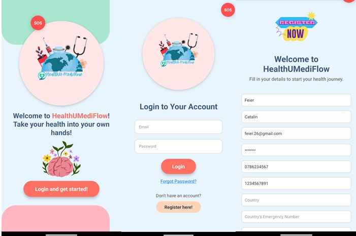

# Welcome to HealthU-MediFlow 👋

This is **HealthU-MediFlow**, a comprehensive **health monitoring app** designed to assist **patients**. It enables **access to all uploaded medical history, symptom tracking, AI-based health insights and appointments**.
 
## Get started

1. Install dependencies

   ```bash
   npm install
   ```

2. Start the app

   ```bash
    npx expo start
   ```

In the output, you'll find options to open the app in a

- [development build](https://docs.expo.dev/develop/development-builds/introduction/)
- [Android emulator](https://docs.expo.dev/workflow/android-studio-emulator/)
- [iOS simulator](https://docs.expo.dev/workflow/ios-simulator/)
- [Expo Go](https://expo.dev/go), a limited sandbox for trying out app development with Expo

You can start developing by editing the files inside the **app** directory. 

## Features

- 📅 **Appointment Tracking** – Schedule and manage doctor appointments easily.
- 📋 **Symptom Tracking** – Log symptoms with text & images, track patterns over time.
- 🚨 **Emergency Call** – Instantly notify a doctor in case of sudden health issues.
- 🤖 **AI-Driven Health Insights** – Get smart recommendations based on health data.
- 📊 **Access to Health Trends** – View long-term health patterns and analytics.
 

